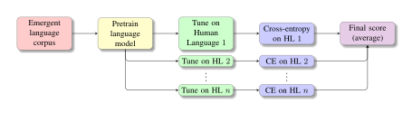

XferBench
=========

XferBench is a benchmark/evaluation metric for emergent language corpora (not
familiar? see [Lazaridou and Baroni, 2020](https://arxiv.org/abs/2006.02419))
presented and published at [NAACL
2024](https://aclanthology.org/2024.naacl-long.82/).  This metric measures the
overall _quality_ of an emergent language using deep transfer learning: the
better that an emergent language serves as pretraining data for a human
language-based downstream task, the more similar it is to human language from
a neural network's perspective.  Below we include a digram describing how
XferBench works.

## Quick Start

Install the conda environment.

    conda create --name xferbench --file environment.txt

Ensure your data is in the JSON lines format where each row is an array of
integer tokens, representing an utterance from the emergent communication
system.  For example,

    [3, 14, 15, 9]
    [2, 6, 5, 35]
    [8, 9, 7, 9, 38, 3]

Then, run the benchmark on the corpus file.

    python -m xferbench some-directory/my_dataset/corpus.jsonl

Output will be in `save-clm/xferbench-my_dataset_corpus/results.json`.

### Citation

If using this work in research please cite the paper:

    @inproceedings{boldt-mortensen-2024-xferbench,
        title = "{X}fer{B}ench: a Data-Driven Benchmark for Emergent Language",
        author = "Boldt, Brendon  and
          Mortensen, David",
        editor = "Duh, Kevin  and
          Gomez, Helena  and
          Bethard, Steven",
        booktitle = "Proceedings of the 2024 Conference of the North American Chapter of the Association for Computational Linguistics: Human Language Technologies (Volume 1: Long Papers)",
        month = jun,
        year = "2024",
        address = "Mexico City, Mexico",
        publisher = "Association for Computational Linguistics",
        url = "https://aclanthology.org/2024.naacl-long.82",
        pages = "1475--1489",
    }
